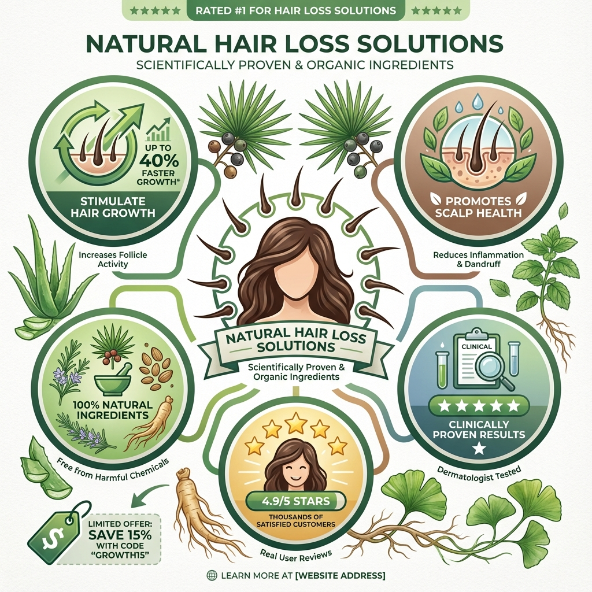

최근 탈모 시장에서 주목받고 있는 성분이 있습니다. 바로 국내 자생식물인 **보리밥나무** 추출물입니다. 국립산림과학원의 연구를 통해 모발 성장의 핵심인 모유두세포를 활성화하는 효과가 과학적으로 입증되면서, 탈모로 고민하는 많은 분들의 관심이 집중되고 있습니다.

이 글에서는 보리밥나무의 탈모 예방 효능, 관련 제품의 가격 정보, 그리고 실제 사용자들의 후기까지 종합적으로 정리해 드립니다. 탈모 케어 제품을 고민하고 계신 분들께 실질적인 도움이 되길 바랍니다.

## 보리밥나무란 무엇인가

보리밥나무는 보리수나무과에 속하는 **상록 활엽 덩굴나무** 로, 한국, 일본, 타이완 등에 분포합니다. 국내에서는 제주도와 남해안 일대의 해안 지역에서 주로 자생하며, 봄보리수나무 또는 봄보리똥나무라고도 불립니다. 작은 가지에 은백색과 연한 갈색의 비늘털이 있는 것이 특징이며, 극한의 자연환경에서도 잘 자라는 강인한 생명력을 가지고 있습니다.

한방에서는 **동조** 라는 한약재로 불리며 오래전부터 약용으로 활용되어 왔습니다. 천식, 기침, 가래, 당뇨 등에 효과가 있다고 알려져 있으며, 지사 및 지혈 작용도 있는 것으로 전해집니다. 열매에는 아스파라긴산이 풍부하게 함유되어 있어 숙취 해소에도 도움이 된다고 합니다.

이처럼 다양한 효능을 가진 보리밥나무가 최근에는 탈모 예방 분야에서 새롭게 주목받고 있습니다. 국가 연구기관인 국립산림과학원이 보리밥나무 추출물의 모발 강화 효과를 과학적으로 입증하면서 탈모 케어 시장에 새로운 바람을 일으키고 있습니다.

## 국립산림과학원이 입증한 탈모 예방 효능

산림청 국립산림과학원은 보리밥나무 추출물이 모발 성장과 발달의 핵심인 **모유두세포** 를 강화하는 효과가 있음을 연구를 통해 밝혀냈습니다. 모유두세포는 모낭 최하단에 위치하여 모발 생성과 성장의 시작점이 되는 핵심 세포입니다. 이 세포의 기능을 활성화하는 것이 탈모 예방의 근본적인 출발점이지만, 그동안 이를 명확히 촉진할 수 있다고 입증된 성분은 많지 않았습니다.

연구 결과에 따르면 보리밥나무 추출물은 모유두세포 활성을 **10ug/ml 농도에서 150%** , **30ug/ml 농도에서 최대 175%** 까지 증가시키는 효과를 나타냈습니다. 모유두세포 강화의 지표가 되는 주요 바이오마커인 베타카테닌과 ALP 역시 유의미하게 증가한 것으로 확인되었습니다.

더욱 주목할 만한 것은 **인체 적용 시험 결과** 입니다. 국립산림과학원은 성인 남녀 20명을 대상으로 12주간 인체 적용 시험을 실시했습니다. 그 결과 사용 전 평균 194.3개였던 탈락 모발 수가 12주 후 75.2개로 감소하여 **61.3%의 개선 효과** 를 보였습니다. 같은 기간 보리밥나무 추출물 없이 미스트만 뿌린 대조군의 탈락 모발 수는 약 40% 감소에 그쳐 20% 포인트 이상의 차이를 보였습니다.

## 모발 건강 지표 전 항목 개선 효과

탈락 모발 감소 외에도 모발과 두피 관련 주요 지표에서 전반적인 개선 효과가 확인되었습니다.

**모발 밀도** 는 1제곱센티미터당 112.7개에서 118.6개로 5.2% 증가했습니다. 이는 같은 면적에서 더 많은 모발이 자라고 있음을 의미하며, 숱이 풍성해지는 효과로 이어집니다.

**모발 굵기** 는 평균 12마이크로미터 굵어져 12.6% 증가했습니다. 가늘어진 모발이 굵어지면 전체적인 볼륨감이 살아나고 두피가 덜 비쳐 보이는 효과를 기대할 수 있습니다.

**두피 탄력** 은 CoR 값 기준 0.565에서 0.649로 14.9% 개선되었습니다. 두피 탄력이 좋아지면 모근이 더 단단하게 자리 잡을 수 있어 모발 탈락 방지에 도움이 됩니다.

**모발 길이** 역시 평균 97마이크로미터 더 자라 17.1% 성장 효과를 보였습니다. 이는 모발 성장 주기가 건강하게 유지되고 있음을 나타내는 지표입니다.

이처럼 보리밥나무 추출물은 단순히 머리카락이 덜 빠지는 것을 넘어 모발의 굵기, 밀도, 길이와 두피 탄력까지 종합적으로 개선하는 효과를 보여주었습니다.

## 닥터방기원 보리밥나무 탈모샴푸 제품 소개

국립산림과학원의 연구 결과를 바탕으로 헤어 및 두피 전문 브랜드 **닥터방기원** 이 보리밥나무 추출물을 적용한 탈모 샴푸를 출시했습니다. 닥터방기원은 국립산림과학원과 기술이전 협약을 체결하고 특허 성분인 보리밥나무가지추출물을 제품에 적용했습니다.

프리미엄 라인업인 **닥터방기원 보리밥나무 바이오 탈모 샴푸** 에는 보리밥나무가지추출물이 200ppm 함유되어 있습니다. 올인원 케어 제품인 **닥터방기원 보리밥나무 탈모 샴푸** 에는 100ppm이 함유되어 있어 취향과 필요에 따라 선택할 수 있습니다.

제품의 특징으로는 보리밥나무 추출물의 유효 성분을 안정적으로 확보하기 위해 새로 돋아난 잔가지를 선별하여 200시간 숙성 공법을 적용했다는 점이 있습니다. 또한 기존 탈모 샴푸들이 주로 두피 환경 개선에 초점을 맞추는 것과 달리, 모발 성장의 핵심인 모유두세포 강화를 목표로 개발되었다는 점에서 차별화됩니다.

## 제품별 가격 정보 안내

닥터방기원 보리밥나무 탈모 샴푸는 다양한 온라인 쇼핑몰에서 구매할 수 있습니다. 제품별 가격 정보를 정리하면 다음과 같습니다.

**닥터방기원 보리밥나무 탈모 샴푸 1000ml** 는 소비자가 50,000원에서 공식몰 기준 할인가 약 34,900원에 판매되고 있습니다. 대용량 제품으로 가성비를 고려하는 분들께 적합합니다.

**닥터방기원 보리밥나무 바이오 탈모 샴푸 1L** 는 프리미엄 라인으로 소비자가 70,000원에서 할인가 약 44,900원에 판매됩니다. 보리밥나무 추출물 함량이 더 높아 집중 케어를 원하는 분들께 추천됩니다.

**바이오 탈모 샴푸 1L 2개 세트** 의 경우 약 79,800원에서 89,500원 사이에 판매되며, 트리트먼트나 헤어토닉 등 증정품이 함께 제공되는 경우가 많습니다.

구매처로는 닥터방기원 공식 홈페이지, 쿠팡, GS샵, 11번가, G마켓, 옥션 등 주요 온라인 쇼핑몰을 이용할 수 있습니다. 가격과 프로모션은 시기와 판매처에 따라 달라질 수 있으니 비교 후 구매하시는 것을 권장합니다. 공식몰 기준 15,000원 이상 구매 시 무료 배송이 적용됩니다.

## 실제 사용자 후기 분석

보리밥나무 탈모 샴푸를 사용한 분들의 후기를 종합해 보면 몇 가지 공통된 평가가 나타납니다.

**사용감에 대한 평가** 로는 거품 밀도가 높아 두피 마사지를 하기 좋다는 의견이 많습니다. 자극감이 없고 헹군 후에도 뻣뻣함이 적어 린스 사용량을 줄여도 모발이 부드럽다는 평가입니다. 향은 인위적인 향료보다는 자연스러운 풀향이 나서 호불호가 갈리지만, 건강한 느낌을 준다는 긍정적 의견이 우세합니다.

**효과에 대한 평가** 로는 즉각적인 변화보다 꾸준히 사용할수록 모발 탄력이 개선되고 빠지는 머리카락이 줄어드는 것을 체감했다는 후기가 있습니다. 국가 기관에서 특허받은 성분이라는 점에서 신뢰감을 갖고 구매했다는 의견도 많습니다.

일부 사용자들은 탈모 커뮤니티에서 보리밥나무 관련 기사를 접하고 관심을 갖게 되었다고 밝혔습니다. 다양한 탈모 샴푸를 사용해 본 후 마지막으로 정착할 제품을 찾는 마음으로 구매했다는 후기도 있었습니다.

다만 탈모 샴푸의 특성상 단기간에 극적인 효과를 기대하기보다는 최소 4주에서 12주 이상 꾸준히 사용해야 변화를 체감할 수 있다는 점을 참고하시기 바랍니다.

## 보리밥나무 탈모제 선택 시 고려사항

보리밥나무 추출물이 함유된 탈모 케어 제품을 선택할 때 몇 가지 고려할 점이 있습니다.

첫째, **보리밥나무 추출물 함량** 을 확인하는 것이 좋습니다. 닥터방기원의 경우 일반 제품은 100ppm, 바이오 라인은 200ppm을 함유하고 있습니다. 함량이 높을수록 가격도 올라가므로 본인의 탈모 고민 정도에 따라 선택하시면 됩니다.

둘째, **두피 타입에 맞는 제품** 인지 확인해야 합니다. 지성 두피와 건성 두피에 따라 적합한 샴푸가 다를 수 있습니다. 제품 설명을 꼼꼼히 읽어보고 본인의 두피 상태에 맞는지 확인하시기 바랍니다.

셋째, 탈모 샴푸는 **보조적인 케어 수단** 이라는 점을 이해해야 합니다. 심각한 탈모 증상이 있다면 전문의 상담을 먼저 받아보시는 것이 좋습니다. 탈모 샴푸는 두피 환경을 개선하고 모발 건강을 보조하는 역할을 하며, 의약품 수준의 치료 효과를 기대하기는 어렵습니다.

넷째, **꾸준한 사용** 이 중요합니다. 인체 적용 시험에서도 12주간 사용 후 유의미한 결과가 나타났듯이, 최소 3개월 이상 꾸준히 사용해야 효과를 체감할 수 있습니다.

## 마무리하며

보리밥나무는 국립산림과학원의 연구를 통해 모유두세포 활성화 효과가 과학적으로 입증된 국내 자생식물입니다. 12주 인체 적용 시험에서 탈락 모발 수 61.3% 감소, 모발 밀도 5.2% 증가, 모발 굵기 12.6% 증가 등 전반적인 모발 건강 지표 개선 효과가 확인되었습니다. 닥터방기원에서 출시한 보리밥나무 탈모 샴푸는 34,900원부터 44,900원 사이에서 구매할 수 있으며, 사용자들은 자극 없는 사용감과 꾸준한 사용 시 체감되는 효과에 긍정적인 평가를 내리고 있습니다. 탈모 고민이 있으신 분들은 국가 연구기관이 효능을 입증한 보리밥나무 성분을 한 번 경험해 보시는 것도 좋은 선택이 될 수 있습니다.

